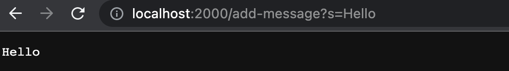
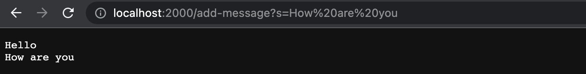
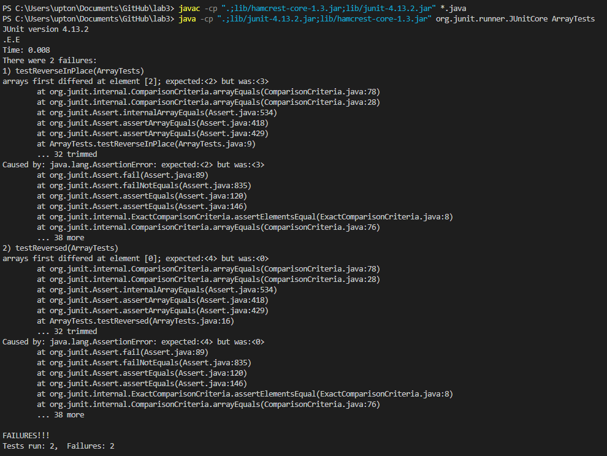
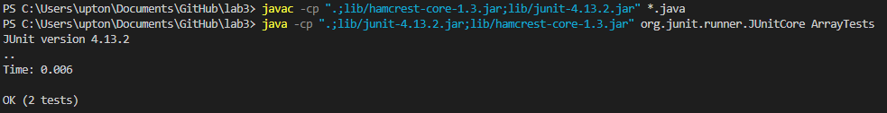

  #  Part 1
  ```
import java.io.IOException;
import java.net.URI;

class Handler implements URLHandler {
    String str = "";

    public String handleRequest(URI url) {
        if (url.getPath().equals("/")) {
            if (str == null || str.equals(""))
            {
                return String.format("No string");
            }
            else
            {
                return String.format("%s",str);
            }
        }  
        else {
            System.out.println("Path: " + url.getPath());
            if (url.getPath().contains("/add-message")) {
                String[] parameters = url.getQuery().split("=");
                if (parameters[0].equals("s")) {
                    str += parameters[1];
                    str += "\n";
                    return String.format(str );
                }
            }
            return "404 Not Found!";
        }
    }
}

class StringServer {
    public static void main(String[] args) throws IOException {
        if(args.length == 0){
            System.out.println("Missing string");
            return;
        }

        int port = Integer.parseInt(args[0]);

        Server.start(port, new Handler());
    }
    
}
  ```
  
  In the first picture, I call the method ```handleRequest```. My program have the setting that it must detect ```/add-message?s=``` before input the string we want to add, which means that if there do not have ```/add-message?s=``` it won't add the string and would goes to the other output that we are not expected. After the program detecting ```/add-message?s=```, I make the ```parameters[1]``` become "Hello". Here I add the ```Hello ``` to  ```str```, ```str```  become ```Hello\n```. It acctually finish the thing we expected what it should do.
  
    In the second picture, I call the method ```handleRequest``` too. I make the ```parameters[1]``` become "How are you". Here I add the ```How are you ``` to  ```str```, ```str```  become ```Hello\nHow are you\n```. By the way, my program have the setting that it must detect ```/add-message?s=``` before input the string we want to add, which means that if there do not have ```/add-message?s=``` it won't add the string and would goes to the other output that we are not expected.  It acctually finish the thing we expected what it should do.
  #  Part 2
  ## The failure-inducing input for the buggy program:
  ```
  @Test 
	public void testReverseInPlace() {
    int[] input1 = { 1,2,3,4 };
    ArrayExamples.reverseInPlace(input1);
    assertArrayEquals(new int[]{ 4,3,2,1 }, input1);
	}


  @Test
  public void testReversed() {
    int[] input1 = { 1,2,3,4 };
    assertArrayEquals(new int[]{ 4,3,2,1 }, ArrayExamples.reversed(input1));
  }
  ```
  The symptom of this input:
  
  ## The input that doesn’t induce a failure:
  ```
  @Test 
	public void testReverseInPlace() {
    int[] input1 = { 1 };
    ArrayExamples.reverseInPlace(input1);
    assertArrayEquals(new int[]{ 1 }, input1);
	}


  @Test
  public void testReversed() {
    int[] input1 = { };
    assertArrayEquals(new int[]{ }, ArrayExamples.reversed(input1));
  }
  ```
  The symptom of this input:
  
  ## Fixing the bug:
  The code before fixing:
  ```
    public class ArrayExamples {

  // Changes the input array to be in reversed order
  static void reverseInPlace(int[] arr) {
    for(int i = 0; i < arr.length; i += 1) {
      arr[i] = arr[arr.length - i - 1];
    }
  }

  // Returns a *new* array with all the elements of the input array in reversed
  // order
  static int[] reversed(int[] arr) {
    int[] newArray = new int[arr.length];
    for(int i = 0; i < arr.length; i += 1) {
      arr[i] = newArray[arr.length - i - 1];
    }
    return arr;
  }

  // Averages the numbers in the array (takes the mean), but leaves out the
  // lowest number when calculating. Returns 0 if there are no elements or just
  // 1 element in the array
  static double averageWithoutLowest(double[] arr) {
    if(arr.length < 2) { return 0.0; }
    double lowest = arr[0];
    for(double num: arr) {
      if(num < lowest) { lowest = num; }
    }
    double sum = 0;
    for(double num: arr) {
      if(num != lowest) { sum += num; }
    }
    return sum / (arr.length - 1);
  }
  }
  ```
  The code after fixing:
  ```
  public class ArrayExamples {

  // Changes the input array to be in reversed order
  static void reverseInPlace(int[] arr) {
    int[] newArray = new int[arr.length];
    for(int i = 0; i < arr.length; i++) {
      newArray[i] = arr[i];
    }
    for(int i = 0; i < arr.length; i += 1) {
      arr[i] = newArray[arr.length - i - 1];
    }
  }

  // Returns a *new* array with all the elements of the input array in reversed
  // order
  static int[] reversed(int[] arr) {
    int[] newArray = new int[arr.length];
    for(int i = 0; i < arr.length; i++) {
      newArray[i] = arr[i];
    }
    for(int i = 0; i < arr.length; i += 1) {
      arr[i] = newArray[arr.length - i - 1];
    }
    return arr;
  }

  // Averages the numbers in the array (takes the mean), but leaves out the
  // lowest number when calculating. Returns 0 if there are no elements or just
  // 1 element in the array
  static double averageWithoutLowest(double[] arr) {
    if(arr.length < 2) { return 0.0; }
    double lowest = arr[0];
    for(double num: arr) {
      if(num < lowest) { lowest = num; }
    }
    double sum = 0;
    for(double num: arr) {
      if(num != lowest) { sum += num; }
    }
    return sum / (arr.length - 1);
  }
}
  ```
  #  Part 3
I learned how to create a github account and operating it. It is very cool that having a webpage that is create by myself because I can add my own project or some course work on it and make my own computer science profile. I think it definitely helps when finding a job. Additionally, I learned how to run the sever on a remote computer, which is something I have never experienced.
