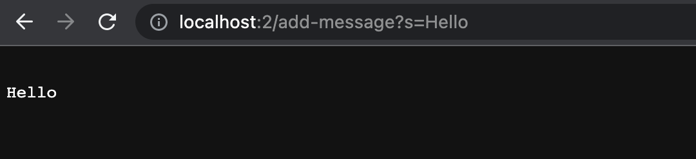
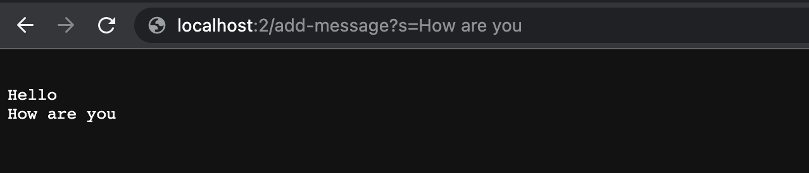

  # Part1
  
  
  ```
  import java.io.IOException;
import java.net.URI;

class Handler implements URLHandler {
    String str = "";

    public String handleRequest(URI url) {
        if (url.getPath().equals("/")) {
            if (str == null || str.equals(""))
            {
                return String.format("No string");
            }
            else
            {
                return String.format("%s",str);
            }
        }  
        else {
            System.out.println("Path: " + url.getPath());
            if (url.getPath().contains("/add-message")) {
                String[] parameters = url.getQuery().split("=");
                if (parameters[0].equals("s")) {
                    str += "\n";
                    str += parameters[1];
                    return String.format(str );
                }
            }
            return "404 Not Found!";
        }
    }
}

class StringServer {
    public static void main(String[] args) throws IOException {
        if(args.length == 0){
            System.out.println("Missing string");
            return;
        }

        int port = Integer.parseInt(args[0]);

        Server.start(port, new Handler());
    }
    
}

  ```
  
  # Part2
  # Part3
